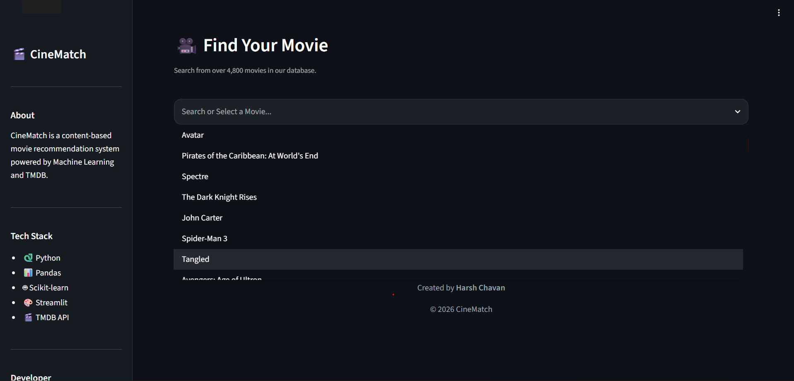
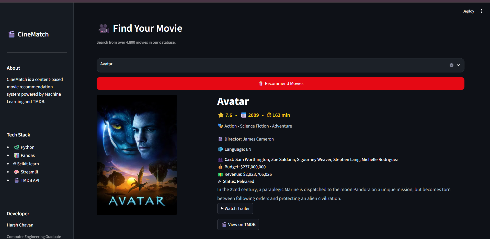
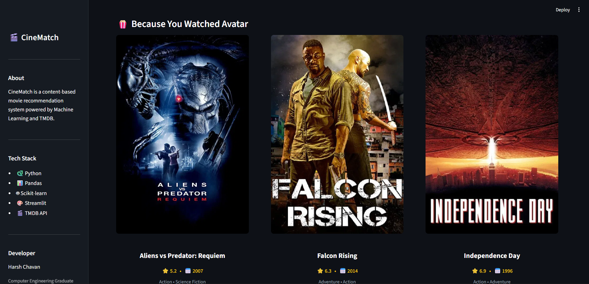

# 🎬 CineMatch


An AI-powered **Content-Based Movie Recommendation System** built using **Machine Learning**, **Streamlit**, and the **TMDB API**.

---

## 📌 Overview

CineMatch helps users discover movies similar to the one they love by analyzing movie content instead of user ratings.

Using **content-based filtering** and **cosine similarity**, the system recommends the five most similar movies from a dataset of over **4,800 movies**. Each recommendation is enriched with live information from the **TMDB API**, including posters, ratings, genres, runtime, director, language, and movie overview.

---

## 🚀 Live Demo

https://harsh-cinematch.onrender.com/
---

## 📸 Preview


### Home Page


### Search Movie



### Movie Details



### Recommendations



---

## ✨ Features

- 🎥 Content-Based Movie Recommendation
- 🔍 Search from 4,800+ Movies
- ⚡ Fast Recommendations using Cosine Similarity
- 🖼️ Movie Posters from TMDB
- ⭐ Movie Ratings
- 🎭 Genres
- 🎬 Director Information
- 👥 Top Cast
- 🌐 Original Language
- 📅 Release Year
- ⏱ Runtime
- 📝 Movie Overview
- 🎨 Modern Streamlit Interface
- 📱 Responsive Layout

---

## 🧠 Recommendation Workflow

```text
User selects a movie
        │
        ▼
Content-Based Filtering
        │
        ▼
CountVectorizer Features
        │
        ▼
Cosine Similarity
        │
        ▼
Top 5 Similar Movies
        │
        ▼
TMDB API
        │
        ▼
Movie Posters & Details
```

---

## 🛠️ Tech Stack

| Category | Technology |
|----------|------------|
| Language | Python |
| Framework | Streamlit |
| Machine Learning | Scikit-learn |
| Data Processing | Pandas |
| API | TMDB API |
| Model Storage | Pickle |

---

## 📂 Project Structure

```text
CineMatch/
│
├── app.py
├── assets/
│   ├── styles.css
│   └── no_poster_avail.jpg
│
├── data/
│   ├── tmdb_5000_movies.csv
│   └── tmdb_5000_credits.csv
│
├── models/
│   ├── movies.pkl
│   └── similarity.pkl
│
├── notebook/
│   └── CineMatch.ipynb
│
├── utils/
│   └── tmdb.py
│
├── requirements.txt
├── .gitignore
├── README.md
└── .env.example
```

---

## 🚀 Installation

### Clone the repository

```bash
git clone https://github.com/harsh8767/CineMatch.git
```

### Navigate to the project

```bash
cd CineMatch
```

### Install dependencies

```bash
pip install -r requirements.txt
```

### Create a `.env` file

```env
TMDB_API_KEY=your_tmdb_api_key
```

### Run the application

```bash
streamlit run app.py
```

---

## 🧠 Machine Learning Workflow

- Load TMDB Movie Dataset
- Data Cleaning & Preprocessing
- Feature Engineering
- Tags Generation
- Text Vectorization using CountVectorizer
- Cosine Similarity Calculation
- Save Model using Pickle
- Build Interactive UI with Streamlit

---

## 📊 Dataset

This project uses the **TMDB 5000 Movie Dataset**, consisting of:

- TMDB 5000 Movies Dataset
- TMDB 5000 Credits Dataset

---

## ⚠️ Known Limitations

- Uses only content-based filtering.
- No personalized user recommendations.
- Requires a valid TMDB API key.
- Recommendations are limited to the dataset.

---

## 🌟 Future Improvements

- ▶️ Movie Trailers
- ❤️ Favorites
- 📚 Watchlist
- 👤 User Authentication
- 🎬 TV Show Recommendations
- 🤝 Collaborative Filtering
- 🔥 Hybrid Recommendation System
- 🌙 Dark / Light Theme Toggle

---

## 🙏 Acknowledgements

- TMDB API
- TMDB 5000 Movie Dataset
- Streamlit
- Scikit-learn
- Pandas

---

## 👨‍💻 Developer

**Harsh Chavan**

Computer Engineering Graduate

GitHub: https://github.com/harsh8767

---

## 📜 License

This project is licensed under the MIT License.
